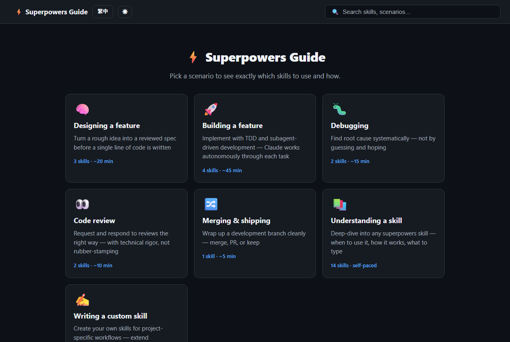

# Superpowers Guide

**Language / 語言：** English | [繁體中文](#繁體中文)

A scenario-first guide to the [Superpowers plugin for Claude Code](https://github.com/obra/superpowers). Pick what you are trying to do — design a feature, build it, debug, review, ship — and get a step-by-step walkthrough: which slash command to type, what Claude does at each step, and what to expect next. All 14 skills are also browsable individually, with live search, copy buttons, light and dark themes, and an **English / 繁體中文** toggle.

Content matches **superpowers v6.3.0** (checked 2026-09-05). See [CHANGELOG.md](CHANGELOG.md) for what changed, when, and by whom.

## Two ways to use it

| | Online | Local |
|---|---|---|
| **Open** | https://peterlwkww-ai.github.io/Superpowers-guide/ | `npm start`, then http://localhost:3000 |
| **Install anything?** | No | Git and Node.js |
| **Works offline?** | No | Yes |
| **Best for** | Reading, sharing with your team, phones and tablets | Editing the content, working without internet |

The online version is rebuilt automatically from `master`, so it is always the latest.



---

## Running locally

### Prerequisites

- **Git** — https://git-scm.com/downloads
- **Node.js** v18 or later — https://nodejs.org

Check with:

```bash
git --version
node --version
```

### Quick start

```bash
git clone https://github.com/peterlwkww-ai/Superpowers-guide.git
cd Superpowers-guide
npm install
npm start
```

You should see:

```
Superpowers Guide running at http://localhost:3000
```

Open **http://localhost:3000** in your browser. Press **Ctrl+C** in the terminal to stop.

### Getting the latest updates

```bash
git pull
npm install
npm start
```

---

## Usage

| Feature | How to use |
|---|---|
| **Browse scenarios** | Click any card on the home page |
| **Copy a command** | Click the **Copy** button next to any slash command |
| **Search** | Type in the search bar (top right). Results update as you type |
| **Browse all skills** | Click "Browse all 14 skills →" at the bottom of the home page |
| **Switch language** | Click **繁中** (or **EN**) in the top-left corner |
| **Switch theme** | Click ☾ or ☀ next to the language button. Follows your system setting until you choose |

Language and theme choices are remembered in your browser.

---

## Opening on your phone

**Easiest:** open https://peterlwkww-ai.github.io/Superpowers-guide/ in your phone's browser. Nothing else to set up.

**From a local server** (phone and PC on the same WiFi):

1. Find your PC's local IP address.

   ```bash
   # Windows
   ipconfig
   # Look for "IPv4 Address" under your WiFi adapter (e.g. 192.168.1.x or 10.x.x.x)

   # macOS / Linux
   ifconfig | grep "inet "
   ```

2. On your phone, go to `http://<your-PC-IP>:3000`, for example `http://192.168.1.42:3000`.

3. If the page doesn't load, Windows may be blocking port 3000. Run this once as Administrator, then try again:

   ```
   netsh advfirewall firewall add rule name="Node 3000" dir=in action=allow protocol=TCP localport=3000
   ```

The server must stay running on your PC while you browse from your phone.

---

## Project structure

```
Superpowers-guide/
├── index.js                    # Express server for local use (serves public/)
├── test.js                     # Data validation + server smoke tests (npm test)
├── public/                     # Self-contained static site, deployed to GitHub Pages
│   ├── index.html              # SPA shell
│   ├── app.js                  # Router, search, language/theme toggles, rendering
│   ├── styles.css              # Light + dark themes, responsive layout
│   ├── data/                   # All content (see "Editing the content")
│   └── vendor/fuse.mjs         # Fuse.js, vendored so Pages needs no build step
├── docs/superpowers/           # Design specs and implementation plans
├── .github/workflows/pages.yml # Test, then deploy public/ to GitHub Pages on push to master
└── CHANGELOG.md                # What changed, when, by whom
```

**Tech stack:** Node.js + Express (local only), vanilla JS and CSS with no build step, Fuse.js for fuzzy search. Hash-based routing (`#/scenario/…`, `#/skill/…`, `#/search?q=…`) so the same files work locally and on Pages.

---

## Editing the content

All text lives in JSON under `public/data/`. No JavaScript changes are needed to update wording, add a step, or adjust a skill.

| File | Contents |
|---|---|
| `scenarios.json` | The 7 scenario walkthroughs |
| `skills.json` | The 14 skills: command, category, when to use, phases |
| `zh-TW.json` | Traditional Chinese translations for everything above, plus UI strings |
| `meta.json` | Which superpowers version the content matches, and when it was last checked |

After editing, run:

```bash
npm test
```

It checks the JSON structure, that every scenario and skill reference resolves, and that every scenario, step, skill, and phase has a zh-TW translation. Push to `master` and the online version updates in about a minute.

### Keeping up with new superpowers releases

The plugin's skills live on your machine under `~/.claude/plugins/cache/claude-plugins-official/superpowers/<version>/skills/<skill>/SKILL.md`. When a new version is installed, compare each `SKILL.md` against the matching entry in `skills.json`, update the wording and phases that changed, translate, then bump `meta.json` and add a CHANGELOG entry.

---

## Contributing

This repository is edited by Peter with the help of AI coding tools (Claude Code and Codex). To avoid stepping on each other:

- Always `git pull` before starting work.
- Run `npm test` before every commit.
- Commit and push after each finished change; do not leave uncommitted work overnight.
- Add a line to [CHANGELOG.md](CHANGELOG.md) with the date, who made the change, and what changed.

---

---

# 繁體中文

**Language / 語言：** [English](#superpowers-guide) | 繁體中文

以情境為主的 [Superpowers 外掛（Claude Code）](https://github.com/obra/superpowers)使用指南。先選你要做的事——設計功能、建置、除錯、審查、發布——就能看到逐步操作說明：該輸入哪個斜線指令、Claude 每一步會做什麼、接下來會發生什麼。14 個技能也可以個別瀏覽，支援即時搜尋、一鍵複製、淺色與深色主題，以及**英文／繁體中文**切換。

內容對應 **superpowers v6.3.0**（2026-09-05 核對）。變更紀錄（日期、修改者、內容）請見 [CHANGELOG.md](CHANGELOG.md)。

## 兩種使用方式

| | 線上 | 本機 |
|---|---|---|
| **開啟方式** | https://peterlwkww-ai.github.io/Superpowers-guide/ | `npm start`，再開 http://localhost:3000 |
| **需要安裝？** | 不用 | Git 與 Node.js |
| **離線可用？** | 否 | 是 |
| **適合** | 閱讀、分享給團隊、手機與平板 | 編輯內容、沒有網路時 |

線上版會從 `master` 自動重新建置，永遠是最新內容。


---

## 在本機執行

### 事前準備

- **Git** — https://git-scm.com/downloads
- **Node.js** v18 或以上 — https://nodejs.org

確認方式：

```bash
git --version
node --version
```

### 快速開始

```bash
git clone https://github.com/peterlwkww-ai/Superpowers-guide.git
cd Superpowers-guide
npm install
npm start
```

看到以下訊息代表啟動成功：

```
Superpowers Guide running at http://localhost:3000
```

在瀏覽器開啟 **http://localhost:3000**。在終端機按 **Ctrl+C** 即可停止。

### 取得最新更新

```bash
git pull
npm install
npm start
```

---

## 功能說明

| 功能 | 操作方式 |
|---|---|
| **瀏覽情境** | 點擊首頁任一卡片 |
| **複製指令** | 點擊任一斜線指令旁的**複製**按鈕 |
| **搜尋** | 在右上角搜尋欄輸入關鍵字，結果即時更新 |
| **瀏覽所有技能** | 點擊首頁底部的「瀏覽全部 14 個技能 →」 |
| **切換語言** | 點擊左上角的**繁中**（或 **EN**）按鈕 |
| **切換主題** | 點擊語言按鈕旁的 ☾ 或 ☀。未選擇前跟隨系統設定 |

語言與主題的選擇會記在瀏覽器裡。

---

## 在手機上開啟

**最簡單：** 直接用手機瀏覽器開 https://peterlwkww-ai.github.io/Superpowers-guide/ ，不用設定任何東西。

**連到本機伺服器**（手機與電腦在同一個 WiFi）：

1. 查詢電腦的本機 IP 位址。

   ```bash
   # Windows
   ipconfig
   # 找到 WiFi 介面卡下的「IPv4 位址」（例如 192.168.1.x 或 10.x.x.x）

   # macOS / Linux
   ifconfig | grep "inet "
   ```

2. 在手機瀏覽器前往 `http://<電腦IP>:3000`，例如 `http://192.168.1.42:3000`。

3. 若頁面無法載入，可能是 Windows 封鎖了 3000 連接埠。以系統管理員身分執行一次以下指令，再重試：

   ```
   netsh advfirewall firewall add rule name="Node 3000" dir=in action=allow protocol=TCP localport=3000
   ```

用手機瀏覽期間，電腦上的伺服器必須持續運行。

---

## 專案結構

```
Superpowers-guide/
├── index.js                    # 本機用的 Express 伺服器（提供 public/）
├── test.js                     # 資料驗證與伺服器測試（npm test）
├── public/                     # 可獨立部署的靜態網站，部署到 GitHub Pages
│   ├── index.html              # SPA 外殼
│   ├── app.js                  # 路由、搜尋、語言／主題切換、畫面渲染
│   ├── styles.css              # 淺色與深色主題、響應式版面
│   ├── data/                   # 所有內容（見「編輯內容」）
│   └── vendor/fuse.mjs         # Fuse.js，內建於 repo 讓 Pages 不需建置步驟
├── docs/superpowers/           # 設計規格與實作計畫
├── .github/workflows/pages.yml # push 到 master 時先測試，再部署 public/ 到 GitHub Pages
└── CHANGELOG.md                # 變更紀錄：日期、修改者、內容
```

**技術架構：** Node.js + Express（僅本機使用）、純 JS 與 CSS 無需建置、Fuse.js 模糊搜尋。使用 hash 路由（`#/scenario/…`、`#/skill/…`、`#/search?q=…`），同一份檔案在本機與 Pages 上都能運作。

---

## 編輯內容

所有文字都在 `public/data/` 的 JSON 檔裡。修改文字、新增步驟、調整技能都不需要動 JavaScript。

| 檔案 | 內容 |
|---|---|
| `scenarios.json` | 7 個情境的操作說明 |
| `skills.json` | 14 個技能：指令、類別、使用時機、階段 |
| `zh-TW.json` | 以上所有內容的繁體中文翻譯，以及介面文字 |
| `meta.json` | 內容對應的 superpowers 版本與最後核對日期 |

編輯後執行：

```bash
npm test
```

會檢查 JSON 結構、每個情境與技能的引用是否存在，以及每個情境、步驟、技能、階段是否都有繁中翻譯。push 到 `master` 後，線上版約一分鐘內更新。

### 跟上 superpowers 的新版本

外掛的技能檔案在你電腦的 `~/.claude/plugins/cache/claude-plugins-official/superpowers/<版本>/skills/<技能>/SKILL.md`。安裝新版本後，逐一比對每個 `SKILL.md` 與 `skills.json` 裡對應的項目，更新有變動的說明與階段，補上翻譯，再更新 `meta.json` 並在 CHANGELOG 加一筆。

---

## 協作方式

這個 repo 由 Peter 搭配 AI 開發工具（Claude Code 與 Codex）共同編輯。為了避免互相覆蓋：

- 開始工作前一定先 `git pull`。
- 每次 commit 前執行 `npm test`。
- 每完成一項變更就 commit 並 push，不要留未提交的變更過夜。
- 在 [CHANGELOG.md](CHANGELOG.md) 加一行：日期、修改者、改了什麼。
